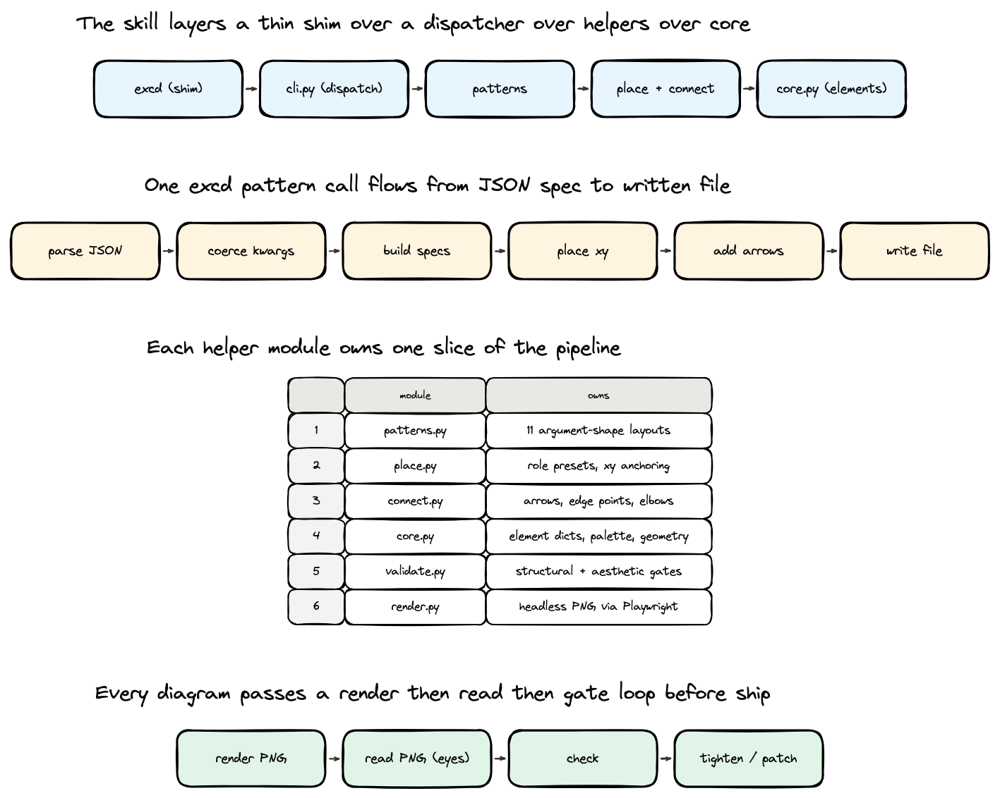

# excalidraw-diagram

A Claude skill for generating `.excalidraw` files that **argue visually** — architecture diagrams, system flows, and visualizations of papers or ideas. Pick a pattern, check, ship — the CLI handles the Excalidraw JSON boilerplate so you control only the artistic decisions.



## Usage

```bash
excd pattern pipeline out.excalidraw '{"title":"Request flows through 3 layers","stages":["Ingest","Transform","Serve"]}'
excd check out.excalidraw                 # structural gate — must exit 0
excd render out.excalidraw -o out.png     # optional: render + read the PNG when refining live
```

Every subcommand has `--help`.

## Patterns

Each maps an argument shape to a layout. One JSON spec per call.

| pattern | argument |
|---|---|
| `pipeline` | N sequential stages |
| `cycle` | a process that loops / repeats |
| `fanout` | one source, many targets |
| `decision_tree` | answer depends on a question |
| `comparison_grid` | X differs from Y on these axes |
| `weight_map` | these N things are not equal |
| `timeline` | events happen at these times |
| `side_by_side` | two systems share a skeleton |
| `nested` | these belong inside that |
| `hub_spoke` | one hub touches many peers |
| `storyboard` | look at these scenes |
| `paired_contrast` | two truths held in tension |

When no pattern fits: `excd place` (role-based layout) or `excd layout` (Graphviz DAGs).

## Architecture

A thin dispatch stack over shared primitives:

- `excd` — bash shim → `helpers/cli.py`
- `cli.py` — argparse dispatcher, no business logic
- `patterns.py` — the 12 layouts, built on `place` + `connect`
- `place.py` / `connect.py` — role presets & xy anchoring / arrows & edge points
- `core.py` / `constants.py` — element dicts, palette, geometry / design constants (sizes, gaps, colors)
- `validate.py` / `render.py` — structural gates / headless PNG via Playwright
- `metrics.py` — mechanical metrics harness (render ms, validator findings, spec size)

See `SKILL.md` for the full pattern catalog, design principles, and the structural gate.

## Setup

- Python 3.11+ (no extra deps for the core CLI)
- `excd render`: `pip install playwright && playwright install chromium`
- `excd layout`: `brew install graphviz`
